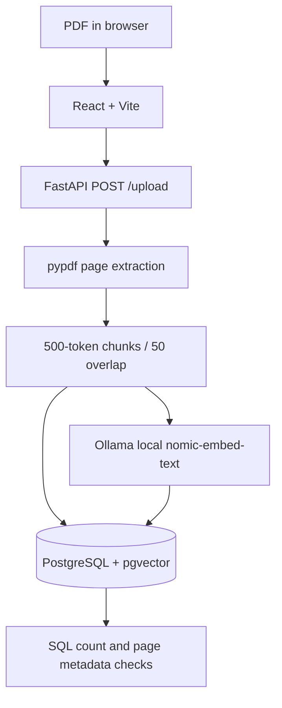

# Day 1 architecture

```mermaid
flowchart TD
  User[PDF in browser] --> UI[React + Vite]
  UI --> API[FastAPI POST /upload]
  API --> PDF[pypdf page extraction]
  PDF --> CHUNK[500-token chunks / 50 overlap]
  CHUNK --> EMB[Ollama local nomic-embed-text]
  CHUNK --> DB[(PostgreSQL + pgvector)]
  EMB --> DB
  DB --> VERIFY[SQL count and page metadata checks]
```

The original PDF binary is not persisted. PostgreSQL stores its metadata plus extracted text chunks, page number, token count and vector embedding.
